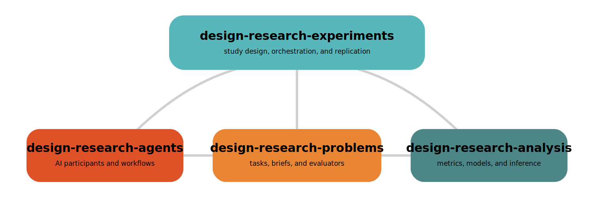

design-research-analysis
========================

The analysis layer for reproducible design-research event data.

What This Library Does
----------------------

``design-research-analysis`` supports sequence analysis, language analysis,
embedding maps, and statistical modeling over unified event-table
inputs. It is built for recurring research workflows where validation,
provenance, and repeatability are first-order concerns.

Unified-table validation and column derivation are core features, not
pre-processing footnotes. They make downstream analyses composable,
reproducible, and easier to compare across studies.

.. raw:: html

   

     
     
     
     
     
   

Highlights
----------

- Unified-table coercion, validation, and mapper-driven derived columns
- Dataset profiling, schema checks, and codebook generation
- Sequence analysis for Markov chains and Hidden Markov Models
- Language analysis for semantic convergence, topic discovery, and sentiment
- Embedding maps and clustering for embedding-space inspection
- Statistical workflows for comparisons, regression, mixed effects, and power
- Runtime provenance capture for reproducible study artifacts

Typical Workflow
----------------

1. Start from a unified event table or an exported
   ``design-research-experiments`` ``events.csv`` artifact.
2. Validate and, when needed, derive missing analysis columns.
3. Run sequence, language, embedding-map, and/or statistical workflows.
4. Persist JSON summaries, CSV exports, and provenance manifests.
5. Rejoin findings to ``runs.csv`` and ``evaluations.csv`` for study context.

.. note::

   **Start with** :doc:`quickstart` for the shortest runnable path, or
   :doc:`experiments_handoff` if you already have ``events.csv`` from
   ``design-research-experiments``.

Integration With The Ecosystem
------------------------------

The Design Research Collective maintains a modular ecosystem of libraries for
studying human and AI design behavior.

- **design-research-agents** implements AI participants, workflows, and tool-using reasoning patterns.
- **design-research-problems** provides benchmark design tasks, prompts, grammars, and evaluators.
- **design-research-analysis** analyzes the traces, event tables, and outcomes generated during studies.
- **design-research-experiments** sits above the stack as the study-design and orchestration layer, defining hypotheses, factors, conditions, replications, and artifact flows across agents, problems, and analysis.

Together these libraries support end-to-end design research pipelines, from
study design through execution and interpretation.

Start Here
----------

- :doc:`quickstart`
- :doc:`installation`
- :doc:`concepts`
- :doc:`experiments_handoff`
- :doc:`typical_workflow`
- :doc:`examples/index`
- :doc:`api`
- `CONTRIBUTING.md <https://github.com/cmudrc/design-research-analysis/blob/main/CONTRIBUTING.md>`_

.. toctree::
   :maxdepth: 2
   :caption: Documentation
   :hidden:

   quickstart
   installation
   concepts
   typical_workflow
   examples/index
   api

.. toctree::
   :maxdepth: 2
   :caption: Development
   :hidden:

   dependencies_and_extras
   Contributing <https://github.com/cmudrc/design-research-analysis/blob/main/CONTRIBUTING.md>

.. toctree::
   :maxdepth: 2
   :caption: Additional Guides
   :hidden:

   experiments_handoff
   workflows
   analysis_recipes
   unified_table_schema
   cli_reference
