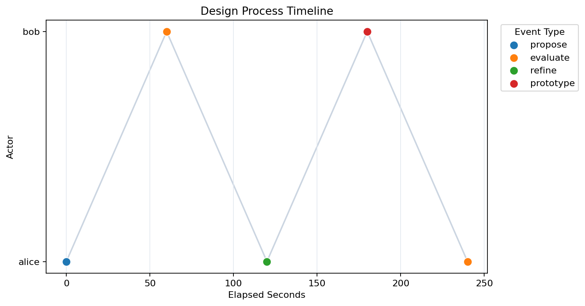

Sequence Workflows
==================

Use sequence workflows when temporal order and transition dynamics are central
study signals.

Typical Questions
-----------------

- How do participants move between event states?
- Are transition structures different across conditions?
- Do latent states explain observed trajectories?

Key API Entry Points
--------------------

- :func:`design_research_analysis.fit_markov_chain_from_table`
- :func:`design_research_analysis.fit_discrete_hmm_from_table`
- :func:`design_research_analysis.fit_text_gaussian_hmm_from_table`
- :func:`design_research_analysis.decode_hmm`
- :func:`design_research_analysis.plot_design_process_timeline`

Timeline View
-------------

``plot_design_process_timeline`` renders one session as an actor-by-time
timeline. Use it when you want a fast visual audit of who acted when before
fitting transition models.

CLI Path
--------

.. code-block:: bash

   design-research-analysis run-sequence \
     --input data/events.csv \
     --summary-json artifacts/sequence.json \
     --mode markov
